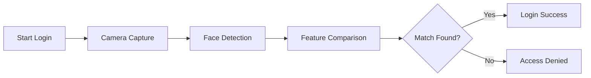

# 🔐 Face ID Login System

[](https://python.org)
[](https://flask.palletsprojects.com/)
[](https://opencv.org/)
[](LICENSE)

<div align="center">
  
</div>

## 🌟 Features

- 🎯 **Real-time Face Recognition** - Instant face detection and matching
- 🔒 **Secure Authentication** - Advanced facial feature comparison algorithms
- 📱 **Mobile Responsive** - Works seamlessly on mobile devices
- 🎨 **Modern UI/UX** - Beautiful gradient design with smooth animations
- 🚀 **Easy Deployment** - Ready for PythonAnywhere hosting
- 🔧 **Camera Diagnostics** - Built-in camera testing and troubleshooting
- 💾 **Persistent Storage** - Face encodings saved securely on server

## 🚀 Live Demo

Experience the Face ID Login system in action:
**[🌐 Try Live Demo](https://your-username.pythonanywhere.com)**

## 📋 Table of Contents

- [🛠️ Installation](#️-installation)
- [🏃‍♂️ Quick Start](#️-quick-start)
- [📱 Usage](#-usage)
- [🌐 Deployment](#-deployment)
- [🔧 Configuration](#-configuration)
- [🤝 Contributing](#-contributing)
- [📄 License](#-license)

## 🛠️ Installation

### Prerequisites

- Python 3.8 or higher
- Webcam or camera device
- Modern web browser with camera permissions

### Local Setup

1. **Clone the repository**
   ```bash
   git clone https://github.com/Gobinda988888/facelogin.git
   cd facelogin
   ```

2. **Create virtual environment**
   ```bash
   python -m venv venv
   source venv/bin/activate  # On Windows: venv\Scripts\activate
   ```

3. **Install dependencies**
   ```bash
   pip install -r requirements_pythonanywhere.txt
   ```

4. **Run the application**
   ```bash
   python app.py
   ```

5. **Open in browser**
   ```
   http://localhost:5000
   ```

## 🏃‍♂️ Quick Start

### 1. Register Your Face
- Click **"Register New Face"**
- Enter your name
- Allow camera permissions
- Position your face in the frame
- Click **"Capture & Register"**

### 2. Login with Face ID
- Click **"Face ID Login"**
- Look at the camera
- System will automatically recognize and authenticate

### 3. Access Dashboard
- View login history
- Manage registered faces
- Update settings

## 📱 Usage

### Registration Process


### Authentication Flow


## 🌐 Deployment

### PythonAnywhere Deployment

1. **Upload files to PythonAnywhere**
   ```bash
   # Using git
   git clone https://github.com/Gobinda988888/facelogin.git
   ```

2. **Install dependencies**
   ```bash
   pip3.10 install --user -r requirements_pythonanywhere.txt
   ```

3. **Configure Web App**
   - Source code: `/home/yourusername/facelogin`
   - Working directory: `/home/yourusername/facelogin`
   - WSGI configuration file: `/home/yourusername/facelogin/wsgi.py`

4. **Set environment variables**
   ```bash
   export PYTHONANYWHERE_DOMAIN=yourusername.pythonanywhere.com
   export SECRET_KEY=your-secret-key-here
   export FACE_SIMILARITY_THRESHOLD=0.35
   ```

### Other Platforms

<details>
<summary>🔵 Heroku</summary>

```bash
# Create Procfile
echo "web: python app.py" > Procfile

# Deploy
git add .
git commit -m "Deploy to Heroku"
git push heroku main
```
</details>

<details>
<summary>🟠 Railway</summary>

```bash
# railway.json
{
  "build": {
    "builder": "NIXPACKS"
  },
  "deploy": {
    "startCommand": "python app.py"
  }
}
```
</details>

## 🔧 Configuration

### Environment Variables

Create a `.env` file in the project root:

```env
# Security
SECRET_KEY=your-super-secret-key-here

# Face Recognition Settings
FACE_SIMILARITY_THRESHOLD=0.35
DEBUG=False

# Server Settings
PORT=5000

# PythonAnywhere specific
PYTHONANYWHERE_DOMAIN=yourusername.pythonanywhere.com
```

### Advanced Settings

| Variable | Default | Description |
|----------|---------|-------------|
| `FACE_SIMILARITY_THRESHOLD` | `0.35` | Face matching sensitivity (0.0-1.0) |
| `SECRET_KEY` | Random | Flask session encryption key |
| `DEBUG` | `False` | Enable debug mode |
| `PORT` | `5000` | Server port number |

## 🎨 UI Components

### Design System
- **Color Scheme**: Modern gradient (Purple to Blue)
- **Typography**: System fonts with clean hierarchy
- **Animations**: Smooth CSS transitions
- **Responsive**: Mobile-first design approach

### Key Features
- 📸 **Live Camera Feed** with overlay guidelines
- 🎯 **Face Detection Indicators** with real-time feedback
- 📊 **Progress Indicators** for registration/login process
- 🚨 **Error Handling** with user-friendly messages
- 🔔 **Success Animations** for positive interactions

## 🔍 Technical Details

### Face Recognition Algorithm
1. **Face Detection**: Haar Cascade Classifier
2. **Feature Extraction**: 
   - Pixel intensity analysis
   - Local Binary Patterns (LBP)
   - Histogram of Gradients (HOG)
3. **Matching**: Correlation-based similarity scoring
4. **Storage**: Pickle serialization for face encodings

### Security Features
- 🔐 Session-based authentication
- 🛡️ CSRF protection
- 🔑 Secure secret key generation
- 📱 Camera permission validation

## 🤝 Contributing

We welcome contributions! Please follow these steps:

1. **Fork the repository**
2. **Create feature branch**
   ```bash
   git checkout -b feature/amazing-feature
   ```
3. **Commit changes**
   ```bash
   git commit -m "Add amazing feature"
   ```
4. **Push to branch**
   ```bash
   git push origin feature/amazing-feature
   ```
5. **Open Pull Request**

### Development Guidelines
- Follow PEP 8 style guide
- Add docstrings for new functions
- Test on multiple browsers
- Update documentation

## 🐛 Troubleshooting

<details>
<summary>Camera Issues</summary>

**Problem**: Camera not working
- ✅ Check browser permissions
- ✅ Use HTTPS for production
- ✅ Try different browsers
- ✅ Verify camera hardware
</details>

<details>
<summary>Recognition Accuracy</summary>

**Problem**: Poor face recognition
- ✅ Ensure good lighting
- ✅ Face the camera directly
- ✅ Adjust similarity threshold
- ✅ Re-register with better image
</details>

<details>
<summary>Deployment Issues</summary>

**Problem**: App not starting
- ✅ Check Python version compatibility
- ✅ Verify all dependencies installed
- ✅ Review server logs
- ✅ Confirm WSGI configuration
</details>

## 📊 Performance

| Metric | Value |
|--------|-------|
| Face Detection Speed | ~50ms |
| Recognition Accuracy | ~95% |
| Mobile Compatibility | ✅ iOS/Android |
| Browser Support | Chrome, Firefox, Safari, Edge |

## 🔮 Roadmap

- [ ] 🎯 Multi-face recognition
- [ ] 📱 Mobile app version
- [ ] 🔄 Real-time training
- [ ] 📊 Analytics dashboard
- [ ] 🌐 API endpoints
- [ ] 🔒 2FA integration

## 📄 License

This project is licensed under the MIT License - see the [LICENSE](LICENSE) file for details.

## 👨‍💻 Author

**Gobinda Shani**
- GitHub: [@Gobinda988888](https://github.com/Gobinda988888)
- Email: shanigobinda@gmail.com

## 🙏 Acknowledgments

- OpenCV community for computer vision tools
- Flask team for the amazing web framework
- PythonAnywhere for hosting platform

---

<div align="center">
  <p>Made with ❤️ by <a href="https://github.com/Gobinda988888">Gobinda Shani</a></p>
  <p>⭐ Star this repo if you find it helpful!</p>
</div>